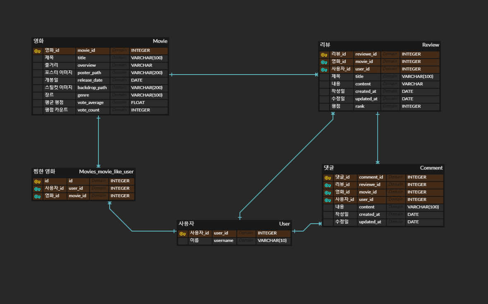
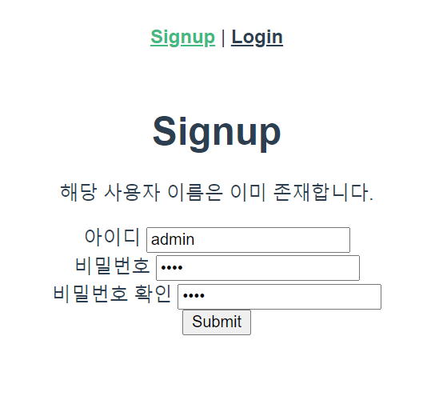
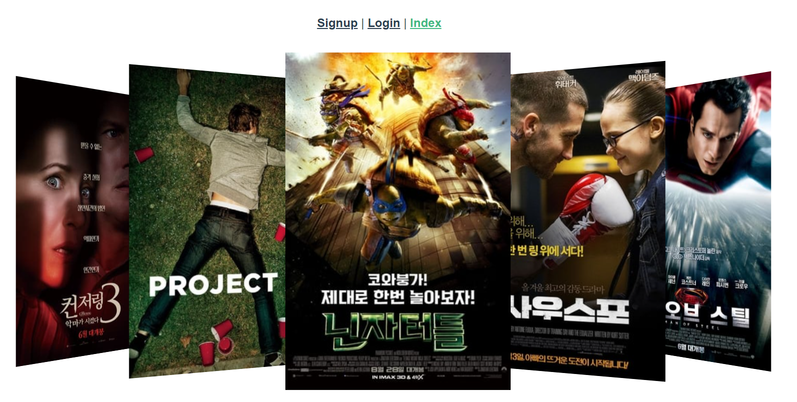
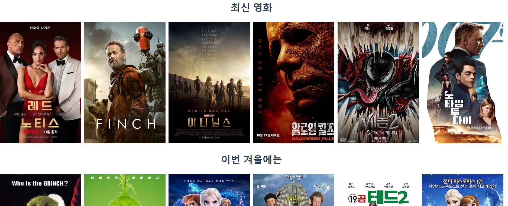
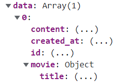
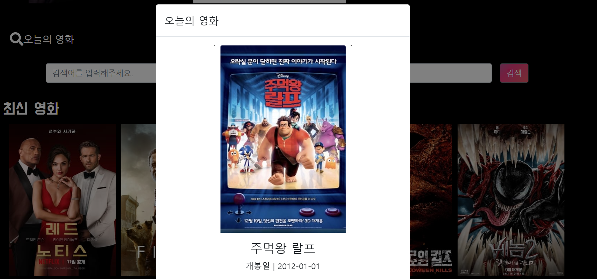
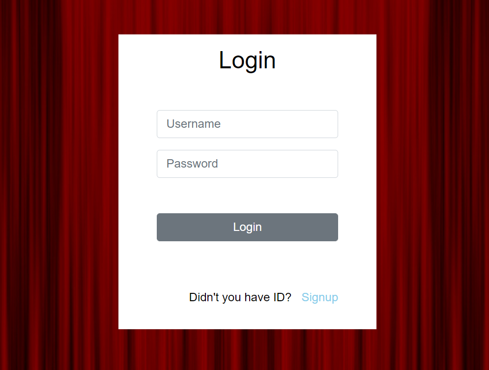
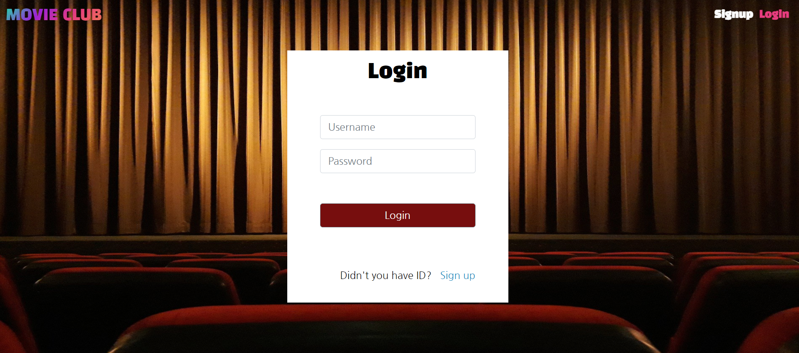
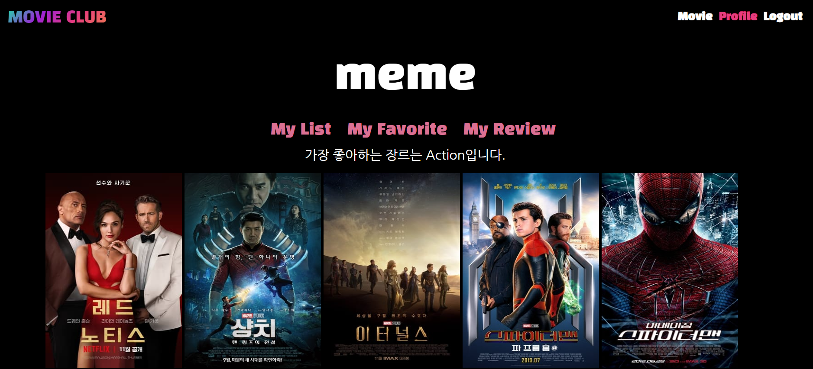

# README

### 🎥Django와 Vue.js를 사용한 영화 추천 웹 사이트

### 🗓️기간 : 2021.12.09~2022.1.3

- movie_index

  > 메인 알고리즘 영화 추천은 vue swiper 사용하기
  >
  > 오늘의 영화는 과거 오늘 날짜에 개봉한 영화 모달로 보여주기 (없으면 없다는 안내메시지)
  >
  > 영화 추천 알고리즘 3개는 총 5개의 포스터 출력하고, > 클릭하면 5개씩 바뀔 수 있도록 구현

- movie_detail

  > 핵심은 유튜브 API
  >
  > 포스터와 영화 설명은 지금 레이아웃처럼
  >
  > 리뷰 작성은 비동기로 구현 (리뷰 작성과 삭제만 만들 것임)

- profile

  > 프로필 사진, 유저네임, 메시지 부분은 지금처럼 구현
  >
  > 찜한 영화는 포스터 이미지로, 가입한 클럽은 클럽 대표 이미지로 출력
  >
  > 스크롤바 사용 X, 전체보기 누르면 모달 통해 전체 영화, 클럽, 리뷰 목록 볼 수 있도록

- search

  > 비동기로 구현

- 그외

  > 로그인, 로그아웃 지금처럼
  >
  > 모달 띄울 때, 가운데로 올 수 있도록
  
- 모달로 구현 : 리뷰 작성


## 🗓️2021.12.09

### movie 데이터 구축

```python
import requests
from .models import Movie


def moviedata():
    API_URL = 'https://api.themoviedb.org/3/discover/movie/'

    for page in range(1, 15):
        payload = {'api_key': 'api_key', 'page': page, 'vote_count.gte': 1000, 'language': 'ko-KR'}
        movie_page = requests.get(API_URL, params=payload).json().get('results')  

        for movie in movie_page:
            movie = Movie(
                title = movie.get('title'),
                overview = movie.get('overview'),
                poster_path = movie.get('poster_path'),
                release_date = movie.get('release_date'),
                vote_average = movie.get('vote_average'),
                vote_count = movie.get('vote_count'),
                genres = movie.get('genre_ids'),
                backdrop_path = movie.get('backdrop_path'),
                popularity = movie.get('popularity'),
            )
            movie.save()
```

- tmdb에서 영화 데이터 불러오기
- 장르 정보는 id 값으로 들어오므로 이후 바꿔주는 과정 필요


## 🗓️2021.12.10

### vue와 django 기본 설정 및 movie 데이터 구축

- front_end와 back_end 폴더로 나누어서 설정

- my_pjt 폴더 안에서 vs 코드 들어가면 back_end 터미널에서 source venv/Scripts/activate 가 안먹힌다..

  > 해결 : 전체적으로 가상환경 연결 (ctrl+shift+p) -> source venv/Scripts/activate

- 라우터 및 vuex 설치

- django에서 movie 모델 만들기

  ```python
  from django.db import models
  from django.conf import settings
  
  # Create your models here.
  class Movie(models.Model):
      title = models.CharField(max_length=100)
      overview = models.TextField()
      poster_path = models.CharField(max_length=200, null=True, blank=True)
      release_date = models.DateField()
      vote_average = models.FloatField()
      vote_count = models.IntegerField()
      like_users = models.ManyToManyField(settings.AUTH_USER_MODEL, related_name='like_movies')
      genres = models.JSONField(null=True)
      backdrop_path = models.CharField(max_length=200, null=True, blank=True)
      popularity = models.FloatField()
      genre = models.CharField(max_length=100, null=True)
  
      def __str__(self):
          return self.title
  ```

- fixtures안에 있는 movies.json DB에 불러오기

  ```python
  python -Xutf8 manage.py loaddata movies.json`
  ```


### ERD




## 🗓️2021.12.11

### 오늘 완료한 일

- Movie, Comment, Post, Club, User 모델 구현

- 기본 설치 및 settings.py 코드 작성

- 로그인과 회원가입 

  > 에러메시지
  >
  > api-token-auth와 jwt 사용

- UserSerializer 생성


### 로그인과 회원가입



- django에서 모든 데이터 처리하고, vue.js에서 보여주기만 함
- 회원가입에서 사용자 이름이 이미 존재하는 경우, 비밀번호와 비밀번호 확인이 일치하지 않는 경우 모두 에러 메시지 출력
- 로그인에서 사용자 아이디가 존재하지 않거나, 비밀번호 다르면 에러메시지 출력
- 에러 메시지는 에러가 발생하지 않으면 null이므로, v-if 문을 통해 에러가 발생하는 경우에만 출력

```vue
.then(() => {
    // console.log(res)
    this.$router.push({ name: 'Login'})
})
.catch(err => {
    if (err.response.data.error)
    	this.message = err.response.data.error    # 비밀번호와 비밀번호 확인이 다른 경우
    if (err.response.data.pass_error)
    	this.message = err.response.data.pass_error  # 비밀번호가 8글자 이하인 경우
    else
    	this.message = err.response.data.username[0]    # username이 존재하는 경우
})
```


### 😥느낀점

오늘 정말 많은 삽질이 있었다.... 1) django 터미널은 꺼놓고, vue 터미널만 켜고 계속 로그인 시도함 -> 당연히 안된다. 2) STATICFILES_DIRS 경로 설정... static 폴더를 back_end 폴더 안에 넣었어야 했는데, back_end와 front_end 폴더가 함께 있는 my_pjt 안에 넣었다... 근데 이거는 VS코드로만 보면 헷갈린다ㅜㅜ 

또한.. 한번에 엄청 많은 코드 작성하고, 서버 켜서 확인하면 안된다. 무조건 하나씩 확인하면서 해야 한다. 처음에 쭉 구현하고, 서버 켰는데 에러 폭발.... 결국 다 지우고 다시 처음부터 만들었다.

그래도 로그인과 회원가입을 모두 끝내놓고 잘 수 있어서 좋다.


## 🗓️2021.12.13

### 오늘 완료한 일

- Movie index, detail 페이지에 영화 정보 불러오기
- 간단한 swiper slide
- 포스터 누르면 영화 detail 페이지로 이동




### 포스터 누르면 영화 detail 페이지로 이동

- 나는 영화 상세 페이지를 router를 사용해서 구현하고 싶었는데, 페이지가 로드되었을 때, 어떻게 movie_pk를 전달시키는지가 핵심이었다. (구글링해도 안나와서... 결국 내가 해결함)

  ```vue
  <script>
  getMovie: function(movie_pk) {
        axios({
          method: 'get',
          url: `http://127.0.0.1:8000/movies/${movie_pk}/`,
          headers: this.setToken()
        })
  }
  
  
  created: function () {
      if (localStorage.getItem('jwt')) {
      	this.getMovie(this.$route.params.movie_pk)
      } else {
      	this.$router.push({name: 'Login'})
      }
  }
  </script>
  ```


### 내일 할 일

- detail 페이지

  > 찜하기
  >
  > 리뷰 작성, 삭제
  >
  > 유튜브 API


### 느낀점

vue를 안 쓴게 너무 후회된다... 생각보다 어렵지 않고..! 무엇보다 코드가 간단한 것 같다. 일단 페이지를 빠르게 구현한 뒤에... 디자인 부분은 마지막에 진행하려고 한다. 영화 포스터 이미지에 마우스를 올리면 상세 정보가 나온다던가... 레이아웃 위치라던가... 이런건 모두 마지막에 하기!


## 🗓️2021.12.14

### 오늘 완료한 일

- detail 페이지 리뷰 비동기로 작성, 삭제


### 영화 리뷰 작성, 삭제

- 한줄 리뷰이기 때문에 수정은 구현하지 않음
- 클럽 post 모델 생성할 때, 수정 구현할 예정
- 리뷰 작성 및 삭제 모두 비동기로 구현!!


### 내일 할 일

- 로그아웃(로그아웃이 안된다...)
- 유튜브 API 불러오기
- 찜하기
- serializer 수정


## 🗓️2021.12.15

### 오늘 완료한 일

- serializer 수정

  > ReviewListSerializer
  
- 찜하기


### 참조된 모델에서 키 값 뿐만 아니라 영화 리스트 모두를 불러오는 방법

- ReviewList view 함수에서 영화의 키 값 뿐만 아니라 영화의 제목도 출력하고 싶다면 아래 코드와 같이 작성해야 한다.

  ```python
  class ReviewListSerializer(serializers.ModelSerializer):
      
      class MovieSerializer(serializers.ModelSerializer):
  
          class Meta:
              model = Movie
              fields = ('title',)                         # 영화의 제목 출력
  
      class Meta:
          model = Review
          fields = '__all__'
          read_only_fileds = ('user', 'movie',)
  
      movie = MovieSerializer(instance=Movie)    # 단일 값이므로 many가 아닌 instance 작성
  ```

  


### username을 불러오는 방법

- accounts 앱에 UserSerializer가 있으므로 재정의할 필요 없이 불러오면 된다.

  ```python
  from accounts.models import User
  from accounts.serializers import UserSerializer  # accounts 앱에서 필요한 정보 불러오기
  
  
  class ReviewListSerializer(serializers.ModelSerializer):
  
      class Meta:
          model = Review
          fields = '__all__'
          read_only_fileds = ('user', 'movie',)
  
      user = UserSerializer(instance=User)
  ```

  

### 찜하기

- `<div v-if="movie.like_users.includes(userpk)">` 

  > 찜하기를 누른 user라면 검은색 하트가, 찜하기를 누르지 않았던 user라면 빨간색 하트가 나온다.

- 로그인한 user의 pk 값을 가져오는 방법 (django에서는 request.user로 해결할 수 있었는데..)

  > 먼저 jwt_decode를 설치한다.
  >
  > jwt를 꺼내서 token 변수에 저장한다.
  >
  > token을 decoding하고, decode 변수에 저장한다.
  >
  > decoded를 출력해보면 user_id, username 등등이 들어있는데, 이 중에서 필요한거 꺼내쓰면 된다.

  ```vue
  <script><
  import jwt_decode from 'jwt-decode';
  
  created: function () {
      if (localStorage.getItem('jwt')) {
        const token = localStorage.getItem('jwt')
        const decoded = jwt_decode(token)
        // console.log(decoded.user_id)
        this.userpk = decoded.user_id
        this.getMovie(this.$route.params.movie_pk)
      } else {
        this.$router.push({name: 'Login'})
      }
  }
  </script>
  ```

- 찜하기 수를 페이지를 들어가자마자 보이게 하는 방법

  > 참고로, res.data.count 이런 식으로 view 함수에서 처리하고, 응답 받은 데이터를 count에 넣는 방법으로 하면 찜하기 버튼을 눌러야만 찜하기 수를 볼 수 있다.

  >`<p>{{ movie.like_users.length }} likes</p>`
  >
  >django와 또 다르다... includes 형식을 보고, 혹시..? 하면서 해본건데 정말 나왔다.


### 내일 할 일

- 유튜브 API (어려울 것 같은... 느낌이... 너무 어려울 것 같으면 바로 포기하고 클럽 기능을 구현하자!)
- 프로필 페이지
- 로그아웃


### 느낀점

vue의 장점과 django의 장점이 명확하게 다른 것 같다... 뭔가 쉬운건 django 같은데... 비동기로 처리할 게 많을 때는 vue를 쓰는게 좋을 것 같다. 남은 기간 화이팅


## 🗓️2021.12.16

### 오늘 완료한 일

- 검색 기능을 비동기로 구현


### search

- 비동기로 구현, movie_index 페이지에 searchform컴포넌트 넣고, searchform 컴포넌트에 searchmovielist 컴포넌트 넣음

  


### 내일 할 일

- 오늘의 영화 모달로 띄우기


## 🗓️2021.12.17

### 오늘 완료한 일

- 로그아웃 에러 수정
- 로그인되어있을 때와 로그아웃 상태일 때 라우터 다르게 보일 수 있도록 수정
- 오늘의 영화


### 로그아웃 에러 수정

```vue
# 처음 작성한 코드
<router-link @click="logout" to="#">Logout</router-link>

# 수정한 코드
<router-link @click.native="logout" to="#">Logout</router-link>
```

- native 옵션 넣어서 구현했더니 로그아웃이 잘 된다.


### 로그인, 아웃 상태일 때의 서로 다른 라우터 출력

```vue
# App.vue
<router-view @login="isLogin = true"/>                  # isLogin = true로 수정


# Login.vue
.then(res => {
    console.log(res)
    localStorage.setItem('jwt', res.data.token)
    this.$emit('login')                          # router-view의 login으로 emit
    this.$router.push({ name: 'Index'})
})
```

- 처음에 isLogin만 작성했더니 오류가 발생하고, 새로고침을 해야만 라우터가 변경되었다.
- isLogin = true로 수정했더니 새로고침을 하지 않아도 라우터가 변경되었다.


### 오늘의 영화



- 모달을 통해 구현
- django 내장 함수인 datetime 사용해서 오늘 날짜를 변수에 저장하고, release_date와 비교


## 🗓️2021.12.19

### 오늘 완료한 일

- 리뷰 작성, 삭제
- 리뷰 디테일 페이지
- 댓글 작성, 삭제


### 리뷰 작성, 삭제

- 리뷰 작성을 동기로, 삭제는 비동기로 구현
- 리뷰 작성은 모달을 통해 작성할 수 있도록 구현할 예정 (내일)


### 댓글 작성, 삭제

- 작성, 삭제 모두 비동기로 구현


### 400 Bad Request

- 오늘 정말 많이 본 에러..
- 구글링 결과, url을 잘못 썼거나 serializer 오류인데, 내 경우는 serializer 오류였음

```python
class CommentListSerializer(serializers.ModelSerializer):
    review = ReviewSerializer(instance=Review)
    user = UserSerializer(instance=User)

    class Meta:
        model = Comment
        fields = '__all__'
        read_only_fields = ('user', 'review',)
        
        
class CommentSerializer(serializers.ModelSerializer):

    class Meta:
        model = Comment
        fields = '__all__'
        read_only_fields = ('user', 'review',)
```

- CommentListSerializer처럼 CommentSerializer에서도 review와 user에 인스턴스를 저장했었는데,  그것이 오류 발생의 원인이었다.
- 해결방법 : 맨 위 두 줄 삭제하니까 해결되었다.


### 내일 할 일

- 리뷰 작성, 수정 (모달)

- 프로필 페이지

  > 찜한 영화 목록
  >
  > 작성한 리뷰 목록
  >
  > 가장 좋아하는 영화 장르와 해당 장르의 영화 랜덤으로 추천


### 🗓️2021.12.21

### 오늘 완료한 일

- 로그인, 회원가입 디자인


### 로그인, 회원가입 디자인



- 모든 페이지의 배경색이 검정색이면 너무 심심할 것 같아서 로그인과 회원가입 배경만 바꾸기로 했다.

- section > container > form 형태의 구조로 되어있고, container의 수평 정렬을 위해서는 section 값에 display: flex; 와 align-items: center; 값을 줘야 한다.

  > 계속 container에 align-items: center 썼는데......

- 에러 발생

  > justify-content: end; 값으로 작성했는데, 출력은 잘 되지만 에러코드가 출력되었다.
  >
  > 구글링해보니, justify-content: flex-end; 로 작성해야 한다고 나왔다. 근데 django 에서는 분명 end로 써서 됐었던 것 같은데... 잘 기억이 안난다.


### 내일 할 일

- 영화 인덱스 페이지


### 에러!!!!

- APP에서 created 될 때, token 에러


### 🗓️2021.12.22

### 오늘 완료한 일

- 영화 인덱스 페이지


### 영화 인덱스 페이지


- 글씨체 모두 수정
- 메인 알고리즘 스와이퍼 수정
- 검색 창과 버튼 수정


### 느낀점

점점 지쳐간다... 그래도 백엔드를 할 때보다는 훨씬 재밌다. 내일도 열심히!!


### 앞으로 남은 것

- 영화 디테일 페이지
- 리뷰 디테일 페이지
- 프로필 페이지 (대대적인 수정 필요....)
- 오늘의 영화 모달 수정


### 🗓️2021.12.23

### 오늘 완료한 일

- 오늘의 영화 모달 수정
- 영화 디테일 페이지 (영화 부분만)


### 영화 디테일 페이지


- 깔끔하게 디자인해보고 싶어서 뒤에 배경은 넣지 않았다.
- 리뷰 작성 버튼은 그라데이션으로


### 내일 할 일

- 영화 디테일 페이지 마무리

  > 리뷰 리스트 구현


### 🗓️~2021.12.28

### 그동안 완료한 일

- 리뷰 디테일 페이지 (완성!!)
- 프로필 페이지 (큰 틀만)

- 로그인, 회원가입 페이지에 배경 넣기


### 로그인, 회원가입 페이지에 배경 넣기



- 처음에 넣었을 때, 배경 이미지가 조금 확대되어 출력되었다. 그래서 의자 부분이 보이지 않았다.

  > background-size를 100% 100% 로 설정하면 전체 이미지가 화면에 출력된다.

- 배경 이미지 Navbar까지 나오게 하기

  > 이거 무려 일주일동안 해결하지 못했는데, 드디어 오늘 해결했다. 그동안 성공하지 못했던 이유는 Navbar를 고칠 생각을 하지 않았고, 각 view에서 해결하려고 했기 때문이다.
  >
  > Navbar 스타일 부분에 아래와 같이 작성해주면 된다.

  ```css
  #navbar {
    position: relative;
    z-index: 99;
  }
  ```


### 수정사항

- created 디코드문제

  > 새로고침하지 않으면 프로필 pk 에러 발생 -> 완료!!

- 삭제 버튼 작성한 사람만 보이도록 하기

- 코드 전체적으로 수정하기

  > 필요없는 코드 삭제
  
- .env 설정

- 프로필 페이지


### 🗓️ 2021.12.30

### 오늘 완료한 일

- 프로필 페이지


### 프로필 페이지



- 찜한 영화, 가장 좋아하는 장르 영화 목록, 작성한 리뷰 출력
- 각각의 버튼을 누르면 v-if 문을 통해 해당되는 컴포넌트를 제외하고, 나머지 컴포넌트는 false로 만들어 보이지 않게 만들었다.


### 내일 할 일

- 삭제 버튼 작성한 사람만 보이도록 하기 -> 완료!!

- 코드 전체적으로 수정하기

  > 필요없는 코드 삭제

- .env 설정

- 프로필 페이지 (가운데 정렬)

- 엔터 누르면 클릭된 것처럼 하기 (회원가입, 로그인, 검색)

- ERD 다시 작성


### 느낀점

끝이 보인다!!!


### 🗓️ 2021.12.31

### 오늘의 할 일

- 삭제 버튼 작성한 사람만 보이도록 하기 -> 완료!!

- 코드 전체적으로 수정하기

  > 필요없는 코드 삭제

- .env 설정

- 프로필 페이지 (가운데 정렬) -> 완료!!

- 엔터 누르면 클릭된 것처럼 하기 (회원가입, 로그인, 검색) -> 완료!!

- ERD 다시 작성 -> 완료!!


### 삭제 버튼은 작성한 사람만 보이도록 하기

- jwt-decode 사용해서 디코딩하고, 현재 user.id 변수에 저장
- v-if 문을 통해 현재 user.id와 작성자가 같으면 삭제 버튼 나타나게 하기


### 엔터 누르면 메서드 실행

- @keyup.enter="메서드"


### 내일 할 일

- 코드 전체적으로 수정하기

  > 필요없는 코드 삭제

- .env 설정 -> 완료!!

- community 페이지 (리뷰 전체 목록 표 형태로)


### 느낀점

빠르면 내일, 늦어도 일요일에는 모두 끝날 것 같다! 한달동안 힘들었지만 해보길 너무 잘한 것 같다. 후회 없음!!


### 🗓️ 2022.01.02

### 오늘의 할 일

- 코드 전체적으로 수정하기
- 리드미 이미지 수정하기 -> 완료!


### 느낀점

드디어 한달 동안의 프로젝트가 끝이 났다. 12월에는 시간적으로 여유가 있어서 시작한건데, 안했으면 후회할 뻔 했다. 특히 Vue.js에 대해서도 공부를 많이 할 수 있었고, 정말 많은 것을 배울 수 있었다. 가장 힘들었던 부분은 공식문서와 구글링을 해도 나오지 않는 오류 해결.... 다른 사람에게 물어볼 수도 없어서.. 해결하는데 오래 걸렸다. 아직 많이 부족하지만 2학기 팀 프로젝트에서 1인분은 꼭..! 하고 싶다. 그때도 프론트엔드 할 예정인데, 열심히 공부하고, 프로젝트를 완성해야겠다.
